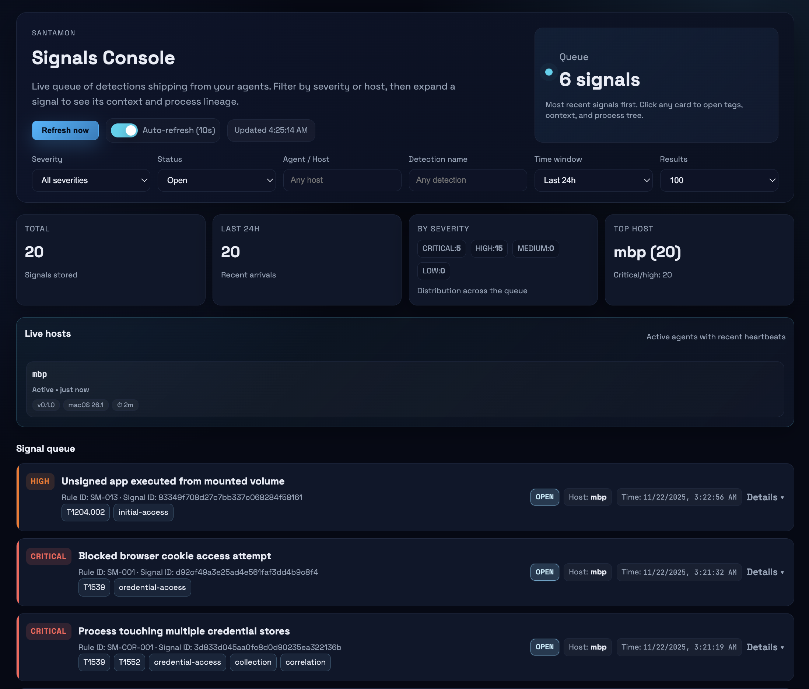

<p align="center"></p>

# Santamon

Lightweight macOS detection sidecar for [Santa](https://github.com/northpolesec/santa) that evaluates Endpoint Security telemetry locally with CEL rules and forwards only matched detection signals to a backend server.

> **Experimental.** Built for home labs and small fleets. Early release – expect bugs and API changes.

## What It Does

Santamon reads Santa's protobuf telemetry stream, evaluates detection rules using CEL expressions, and ships security signals to a backend. Raw telemetry stays on the endpoint—only detections are forwarded.

**Core capabilities:**
- **Local detection:** CEL-based rules evaluate events on-device
- **Three rule types:** Simple matching, time-window correlation, baseline (first-seen)
- **Process lineage:** Optionally attach full process trees to execution signals
- **Embedded state:** BoltDB tracks correlations, first-seen data, and signal queue
- **Resilient shipping:** Concurrent batching, retry logic, circuit breaker

## Why Santamon?

Santamon is a **detection sidecar** for Santa, not another ESF client.

Building a custom ESF tool requires Apple's restricted entitlements, provisioning profiles, and careful handling of high-volume Endpoint Security events. Santa already does this and is battle-tested in production.

**Santamon's value:**
- **Reuses Santa** as the ESF sensor layer (no additional entitlements)
- **Runs rules locally** close to the data, instead of streaming everything
- **Lightweight state** via BoltDB for correlations and deduplication
- **Low infrastructure cost** - only ships high-signal detections

Santa handles the heavy lifting of ingesting Endpoint Security events reliably and safely; Santamon focuses on detection logic and signal quality.

## Architecture

```
Santa Spool → Watcher → Decoder → Rules Engine → Signal Generator → Shipper → Backend
                 ↓                      ↓
                ┌────────────────────────┐
                │ State DB (BoltDB)      │
                │ • Correlation windows  │
                │ • Baseline tracking    │
                │ • Signal queue         │
                └────────────────────────┘
                Process lineage: in-memory cache (1h TTL, 50K max)
```

**Data flow:**
1. **Watcher** monitors Santa's spool directory (`/var/db/santa/spool/new/`) for new protobuf files
2. **Decoder** reads and decompresses protobuf messages from spool files
3. **Rules Engine** evaluates events against CEL expressions (simple, correlation, baseline rules)
4. **Signal Generator** creates context-rich signals for rule matches (with optional process trees)
5. **Shipper** batches and sends signals to backend via HTTPS with retry logic and circuit breaker
6. **State DB** persists correlation state, baseline tracking, signal queue, and spool journal

**Process Lineage:**
- In-memory cache of recent process execution history
- Enables full process tree context for execution detections
- TTL: 1 hour | Max: 50K entries (LRU eviction)
- Boot session isolated (no cross-boot ancestry)
- See [RULES.md](RULES.md#process-trees) for usage

## Requirements

- **macOS 15.4+** (some telemetry types like `tcc_modification` require macOS 15+)
- **Santa with protobuf telemetry** from [northpolesec/santa](https://github.com/northpolesec/santa)
  - See [Santa telemetry docs](https://northpole.dev/features/telemetry/)
  - Example config: [`configs/examples/santa-config.mobileconfig`](configs/examples/santa-config.mobileconfig)
- **Go 1.23+** (for building from source)

## Installation

### 1. Configure Santa for Protobuf Telemetry

Santa must be configured to write protobuf events. Use the provided configuration profile:

```bash
# Review and customize, then install via System Settings
open configs/examples/santa-config.mobileconfig

# Verify
santactl status | grep "Log Type"
# Should show: Log Type | protobuf
```

### 2. Build Santamon

```bash
git clone https://github.com/0x4d31/santamon.git
cd santamon
make build
```

### 3. Install System-Wide

```bash
sudo make install
```

This installs:
- Binary: `/usr/local/bin/santamon`
- Config: `/etc/santamon/config.yaml` and `rules.yaml`
- LaunchDaemon: `/Library/LaunchDaemons/com.santamon.plist`
- State directory: `/var/lib/santamon/`

### 4. Configure Backend and API Key

Edit `/etc/santamon/config.yaml`:

```yaml
shipper:
  endpoint: "https://your-backend.example.com:8443/ingest"
  api_key: "${SANTAMON_API_KEY}"
```

Set the API key in the LaunchDaemon plist:

```bash
# Generate strong API key
openssl rand -hex 32

# Edit LaunchDaemon
sudo nano /Library/LaunchDaemons/com.santamon.plist

# Add under EnvironmentVariables:
<key>SANTAMON_API_KEY</key>
<string>your-generated-key-here</string>
```

### 5. Start

```bash
# Start service
sudo make start

# Monitor logs
make logs
```

## Configuration

Main config: `/etc/santamon/config.yaml`

<details>
<summary>Minimal configuration example</summary>

```yaml
agent:
  id: "${HOSTNAME}"

shipper:
  endpoint: "https://backend.example.com:8443/ingest"
  api_key: "${SANTAMON_API_KEY}"
```

</details>

<details>
<summary>Key settings</summary>

```yaml
santa:
  spool_dir: "/var/db/santa/spool"      # Santa spool location
  stability_wait: "2s"                  # Wait before reading new files

rules:
  path: "/etc/santamon/rules.yaml"      # File or directory

state:
  db_path: "/var/lib/santamon/state.db"
  sync_writes: true                     # Fsync after writes (safer but slower)

  first_seen:
    max_entries: 10000                  # LRU cache for baseline rules

  windows:
    max_events: 1000                    # Max events per correlation window

shipper:
  batch_size: 100                       # Signals per batch
  flush_interval: "30s"                 # Time between flushes
  timeout: "10s"                        # HTTP request timeout
  tls_skip_verify: false                # NEVER true in production
```

</details>

See [`configs/santamon.yaml`](configs/santamon.yaml) for all options with detailed comments.

## Detection Rules

Rules are CEL expressions that evaluate Santa events. Three types supported: **simple**, **correlation**, and **baseline**.

<details>
<summary>Simple rule example</summary>

```yaml
rules:
  - id: SM-014
    title: "Non-interactive process invoking curl/wget"
    description: |
      Non-terminal, non-package-manager process launching curl or wget.
    expr: |
      kind == "execution" &&
      execution.target.executable.path in ["/usr/bin/curl", "/usr/bin/wget"] &&

      // Exclude interactive shells
      !(
        execution.instigator.executable.path.startsWith("/bin/bash") ||
        execution.instigator.executable.path.startsWith("/bin/zsh") ||
        execution.instigator.executable.path.startsWith("/bin/sh")
      ) &&

      // Exclude Homebrew / package-manager helpers that legitimately use curl frequently
      !(
        execution.instigator.executable.path.startsWith("/opt/homebrew/") ||
        execution.instigator.executable.path.contains("/Homebrew/")
      )
    severity: high
    tags: ["T1105", "command-and-control"]
    extra_context: ["execution.args"]
    include_process_tree: true
    enabled: true
```

</details>

<details>
<summary>Correlation rule (multiple events in time window)</summary>

```yaml
correlations:
  - id: SM-COR-001
    title: "Process touching multiple credential stores"
    description: "Single process accessing 3+ credential stores within 5 minutes."
    expr: |
      kind == "file_access" &&
      file_access.policy_name in [
        "ChromeCookies", "CometCookies", "SSHPrivateKeys",
        "BrowserPasswords", "KeychainDB"
      ]
    window: "5m"
    group_by: ["file_access.instigator.executable.path"]
    count_distinct: "file_access.policy_name"
    threshold: 3
    severity: critical
    tags: ["T1539", "T1552", "credential-access"]
    enabled: true
```

</details>

<details>
<summary>Baseline rule (first-seen detection)</summary>

```yaml
baselines:
  - id: SM-BASE-001
    title: "First-time unsigned binary executed from user paths"
    description: "First time an unsigned binary executes from /Users paths."
    expr: |
      kind == "execution" &&
      execution.decision == "DECISION_ALLOW" &&
      execution.target.executable.path.startsWith("/Users/") &&
      (
        execution.target.code_signature == null ||
        !has(execution.target.code_signature.team_id) ||
        execution.target.code_signature.team_id == ""
      )
    track: ["execution.target.executable.cdhash"]
    learning_period: "720h"
    severity: high
    tags: ["T1204.002", "initial-access"]
    enabled: true
```

</details>

**Rule organization:** Single file (`/etc/santamon/rules.yaml`) or multi-file directory structure.

**Validate before deploying:**
```bash
santamon rules validate
```

See **[RULES.md](RULES.md)** for comprehensive guide.

## Backend

Santamon requires a backend to receive signals. A minimal FastAPI backend is included in [`backend/`](backend/).

**What it does:**
- Receives signals via `POST /ingest` (requires API key)
- Stores signals in SQLite database
- Provides query API (`GET /signals`, `GET /stats`)
- Tracks agent health via heartbeats (`POST /agents/heartbeat`)
- Web UI for signal management

**Quick start:**
```bash
cd backend
pip install fastapi uvicorn

# Set API key
export SANTAMON_API_KEY="your-key-here"

# Run (uses HTTPS if cert.pem exists, otherwise HTTP)
python backend.py
```



See **[backend/README.md](backend/README.md)**.

## CLI Commands

```bash
# Run agent (foreground, verbose mode)
santamon run --verbose

# Validate rules
santamon rules validate

# Show status
santamon status

# Database operations
santamon db stats      # Show statistics
santamon db compact    # Compact database

# Version
santamon version
```

## Documentation

- **[RULES.md](RULES.md)** - Detection rule writing guide
- **[SECURITY.md](SECURITY.md)** - Security considerations and agent resilience
- **[backend/README.md](backend/README.md)** - Backend deployment guide
- **[configs/santamon.yaml](configs/santamon.yaml)** - Full configuration reference
- **[configs/rules.yaml](configs/rules.yaml)** - Example detection rules
